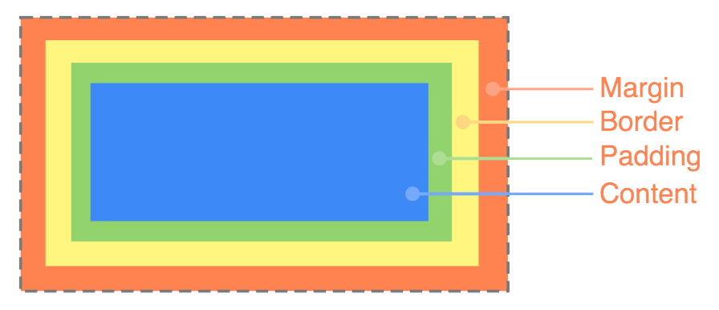

# CSS Box Model

1. [Margin & Padding](#margin--padding)
2. [Border](#border)
3. [Content](#content)
4. [Box Sizing](#box-sizing)

The Box Model determines how HTML elements are positioned relative to each other. The `margin` represents the spacing around an element, the `border` represents the spacing on the boundary of an element, and the `padding` represents spacing within an element. You can read more about the box model on the [MDN](https://developer.mozilla.org/en-US/docs/Web/CSS/CSS_Box_Model/Introduction_to_the_CSS_box_model). You can read more about length units in the [CSS Overview](03%20-%20CSS%20Overview.md#css-lengths).



## Margin & Padding

The `margin` represents the space around the element, while `padding` represents the space within an element.

| number of parameters specified | what they pertain to |
|--- |--- |
| 1 | top & bottom & left & right |
| 2 | top & bottom, left & right |
| 3 | top, left & right, bottom |
| 4 | top, right, bottom, left |

For example, `padding: 25px 50px 75px 100px;` means the top padding is `25px`, the right padding to `50px`, the bottom padding is `75px`, and the left padding is `100px`. Likewise, `margin: 10px` means the top, bottom, left, and right margin will all be `10px`.

You may also specify the sides individually.

| property | description |
|--- |--- |
| `margin` | specify the margin for every side |
| `margin-top` | the top margin |
| `margin-bottom` | the bottom margin |
| `margin-left` | the left margin |
| `margin-right` | the right margin |
| `padding` | specify the padding for every side |
| `padding-top` | the top padding |
| `padding-bottom` | the bottom padding |
| `padding-left` | the left padding |
| `padding-right` | the right padding |


## Border

You can read more about borders [here](https://www.w3schools.com/css/css_border.asp).


## Content

You can control the content's size directly using the properties below. You can read more about content sizing [here](https://www.w3schools.com/css/css_dimension.asp).

| Property | Default | Description |
|--- |--- |--- |
| `width` | `auto` | the width of an element |
| `height` | `auto` | the height of an element |
| `min-width` | `none` | the minimum width of an element |
| `min-height` | `none` | the minimum height of an element |
| `max-width` | `none` | the maximum width of an element |
| `max-height` | `none` | the maximum height of an element |


## Box Sizing

The css property `box-sizing` lets your control how `width` and `height` calculations account for the content's size, margin, border, and padding. You can read more about `box-sizing` [here](https://developer.mozilla.org/en-US/docs/Web/CSS/box-sizing), [here](https://www.w3schools.com/cssref/css3_pr_box-sizing.asp), and [here](https://css-tricks.com/box-sizing/). The `box-sizing` property can have the following values:

- `content-box` (default): width and height values apply to the element's content, padding and border are added to the outside
- `padding-box`: width and height values apply to the element's content and padding, border is added to the outside
- `border-box`: width and height apply to the content, padding, and border
- `inherit`: inherit the value of the parent

To apply `border-box` to all elements, use the code below

```css
html {
    box-sizing: border-box;
}
*, *:before, *:after {
    box-sizing: inherit;
}
```